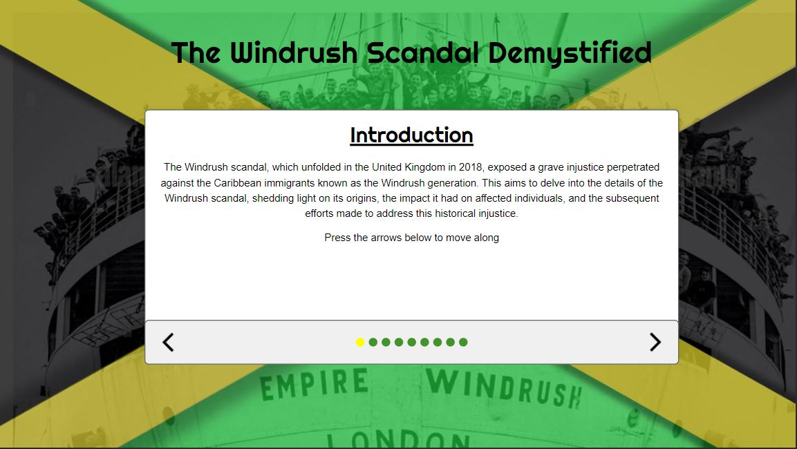

# WindRush Website: The Windrush Scandal Demystified

Welcome to the WindRush website! This website aims to shed light on the Windrush scandal, providing comprehensive information and resources to help demystify the events and consequences surrounding this important issue.

## Table of Contents

- [About the Project](#about-the-project)
- [Features](#features)
- [Getting Started](#getting-started)
- [Usage](#usage)
- [Contributing](#contributing)
- [License](#license)
- [Contact](#contact)

## About the Project

The Windrush scandal refers to a series of events in the United Kingdom that affected the Windrush generation and their descendants, who faced wrongful detention, deportation, and denial of basic rights despite being legally entitled to live and work in the country. This website aims to educate and raise awareness about this issue by providing a centralized platform for information, stories, and resources.

## Pictures

## Getting Started

To run this website locally, follow these steps:

1. Clone this repository: `git clone https://github.com/your-username/WindRush-Website.git`
2. Navigate to the project directory: `cd WindRush-Website`
3. Open the `index.html` file in your web browser.

## Usage

Once you have the website up and running, you can explore the different sections to learn about the Windrush scandal. The navigation menu provides easy access to the main features and resources.

If you have any questions or need further assistance, don't hesitate to reach out to us (contact details provided below).

## Contributing

We welcome contributions from the community to enhance this website. If you would like to contribute, please follow these steps:

1. Fork the repository on GitHub.
2. Create a new branch with a descriptive name: `git checkout -b feature/my-awesome-contribution`.
3. Make your changes and test thoroughly.
4. Commit your changes: `git commit -m "Add my awesome contribution"`.
5. Push to the branch: `git push origin feature/my-awesome-contribution`.
6. Open a pull request on GitHub.

Please ensure your contributions adhere to our code of conduct.

## License

This project is licensed under the [MIT License](LICENSE).

## Contact

For any inquiries or suggestions regarding the WindRush website, please contact me on discord at Joelmatic#8817

Thank you for visiting our website and joining us in demystifying the Windrush scandal! Together, we can make a difference.
